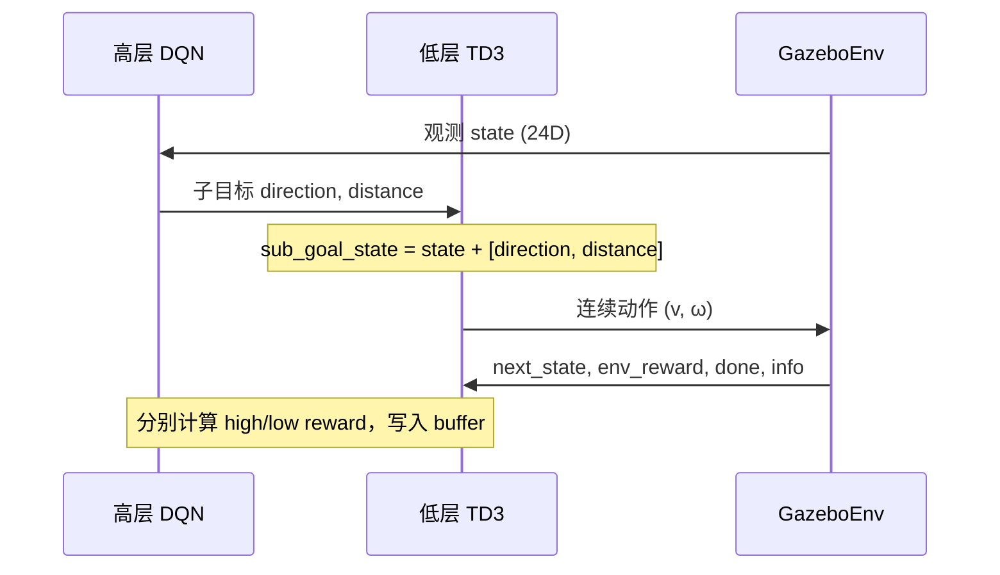

# 分层强化学习模块

证据状态：除特别标注外，本页基于当前源码已确认。

## 白话模型

分层方案把导航拆成两个决策频率相同的智能体，但在每步里各干一件事：

- **高层（DQN）**：在 20 个方向 × 10 档距离 = 200 个离散动作里，选一个「往哪走、走多远」的子目标。
- **低层（TD3）**：收到激光观测加上子目标后，输出连续线速度与角速度，驱动 Gazebo 里的机器人。

两层共用同一个 Gazebo 环境，但奖励分开算：高层看子目标是否合理、路径是否平滑；低层叠加环境原始奖励与子目标完成度。

训练不走 SB3 自带的 `learn()` rollout，而是手写采样循环，只借用 SB3 的 `predict()` 和 `train()` 做推理与梯度更新。

## 代码模型

核心类为 [HierarchicalRL](../../TD3/hierarchical_rl.py)，入口脚本为 [train_hierarchical.py](../../TD3/train_hierarchical.py)。

### 初始化链路

```
train_hierarchical.py
  └─ HierarchicalRL.__init__
       ├─ _init_environment()      → VelodyneGymWrapper
       ├─ _init_replay_buffers()    → 使用 SB3 内置 buffer（高层/低层各一份）
       ├─ _init_high_level_agent()  → DQN + DiscreteActionEnvWrapper
       └─ _init_low_level_agent()   → TD3 + ExtendedObservationEnvWrapper（26 维观测）
```

### 每步交互（train 循环）



关键代码位置：

- 子目标解码：[hierarchical_rl.py L586-L588](../../TD3/hierarchical_rl.py)
- 奖励计算：`_calculate_rewards`（方向/距离/避障/平滑/碰撞/时间惩罚）
- 梯度更新：每 `train_freq=100` 步且 buffer > `learn_starts=1000`

### 高层奖励（源码实现）

与论文公式对应，权重为 `w1=w2=0.4, w3=w4=0.1`：

| 成分 | 含义 |
| --- | --- |
| `direction_reward` | 实际移动方向与子目标方向的偏差 |
| `distance_reward` | 实际步长与子目标距离的偏差 |
| `obstacle_avoidance_reward` | `info['obstacle_ahead']` 为假时 +0.2（**注：当前 `gym_wrapper` 未填充该字段，此项恒为 0**） |
| `smoothness_reward` | 相邻步方向变化惩罚 |
| `collision_penalty` | 非成功结束 -1.0 |
| `time_penalty` | 每步 -0.01 |

### 低层奖励

```
low_level_reward = env_reward + 0.5 * (direction_reward + distance_reward) + 0.5 * collision_penalty
```

`env_reward` 来自 [GazeboEnv.get_reward](../../TD3/velodyne_env.py)。

### 评估

`evaluate_detailed()` 在训练环境上跑若干回合，统计成功率、碰撞率、路径效率、轨迹平滑度、时间成本，结果写入 `logs/evaluation_metrics.npy` 并同步 TensorBoard。

成功判定：终点距目标 < 0.3 m（与 `GOAL_REACHED_DIST` 一致）。

## 已知不足（源码与论文交叉确认）

以下不是文档挑剔，而是当前实现的真实限制：

1. **训练不稳定**：论文明确写道 DQN+TD3 常原地旋转、难收敛；单层 TD3 反而更稳。
2. **高层奖励延迟更新粗糙**：回合结束时只把 `episode_reward` 写回 buffer 最后一条经验（L700-L708），与标准 episodic credit assignment 差距较大。
3. **强制 CPU**：`HierarchicalRL` 在 `__init__` 里写死 `self.device = torch.device("cpu")`，与 `train_hierarchical.py` 传入的 `device` 参数不一致。
4. **`obstacle_ahead` 未实现**：避障奖励分支依赖的 info 字段未被环境填充。
5. **Optuna 超参搜索**：`optimize_hyperparameters()` 存在，但 `objective()` 内会跑完整 `train()`，代价高且与主流程耦合松散；`train_hierarchical.py` 未暴露 `--optimize` 开关（仅在 `hierarchical_rl.py` 的 `__main__` 中有）。
6. **双层非平稳性**：两层策略同步更新，彼此改变对方的状态分布，论文亦列为不稳定原因之一。

## 接下去阅读

- 环境如何产生 24 维观测 → [仿真环境模块](gazebo-environment.md)
- 对比单层 TD3 入口 → [训练入口模块](training-scripts.md)
- 奖励与阈值查表 → [观测、动作与奖励](../references/observation-action-reward.md)
