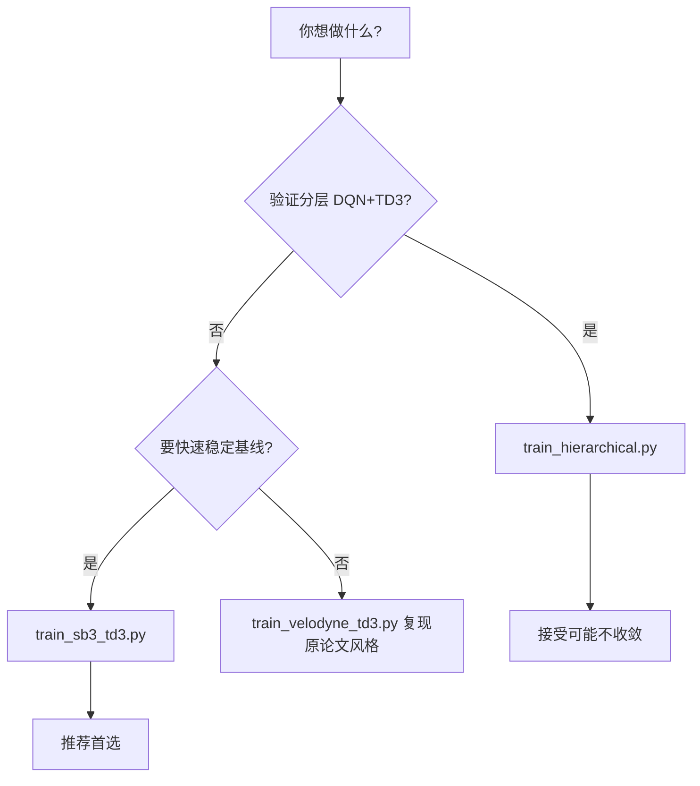

# 训练入口模块

证据状态：除特别标注外，本页基于当前源码已确认。

## 白话模型

[TD3](../../TD3) 目录下有多个「运行脚本」，共用同一套 Gazebo 环境，但算法封装方式不同。可以把它看成三条产品线：

1. **分层实验线**：DQN 规划 + TD3 执行，手写训练循环
2. **SB3 标准线**：交给 Stable-Baselines3 的 `learn()`，维护成本低
3. **原版自定义线**：手写 Actor-Critic 与 ReplayBuffer，来自 DRL-robot-navigation 传统

选哪条取决于你是要验证分层想法，还是要一个能稳定收敛的基线。

## 代码模型

| 脚本 | 算法 | 关键依赖 | 成熟度（项目自述） |
| --- | --- | --- | --- |
| [train_hierarchical.py](../../TD3/train_hierarchical.py) | DQN + TD3 分层 | `hierarchical_rl.HierarchicalRL` | 实验性，不稳定 |
| [train_sb3_td3.py](../../TD3/train_sb3_td3.py) | SB3 TD3 | `VelodyneGymWrapper` + `DetailedEvaluationCallback` | 推荐基线 |
| [train_velodyne_td3.py](../../TD3/train_velodyne_td3.py) | 自定义 TD3 | `GazeboEnv` 直连 + `replay_buffer.ReplayBuffer` | 成熟，论文主要对比对象 |
| [train_sb3_DQN.py](../../TD3/train_sb3_DQN.py) | SB3 DQN | `action_type="discrete"` | 单层离散控制 |
| [train_dqn.py](../../TD3/train_dqn.py) | 自定义 DQN | 离散动作映射 | 较旧入口 |
| [test_velodyne_td3.py](../../TD3/test_velodyne_td3.py) | 推理测试 | 加载已训 Actor 网络 | 评估用 |

配置文件：[configs/td3_velodyne.yaml](../../TD3/configs/td3_velodyne.yaml) 记录 SB3 TD3 超参参考值，但未见统一加载器（**未确认是否有脚本自动读 yaml**）。

### train_hierarchical.py

- 解析 `--environment_dim`、`--max_timesteps`、`--eval_freq`、`--device`、`--load_high_level`、`--load_low_level`
- 注意：`HierarchicalRL` 内部仍强制 CPU，传入 `cuda` 可能不生效

### train_sb3_td3.py

- 使用 `TD3("MlpPolicy", env, ...)`
- `DetailedEvaluationCallback` 每 5000 步评估并写 `logs/evaluation_metrics.npy`
- 检查点保存到 `pytorch_models/sb3_td3/`

### train_velodyne_td3.py

- 动作经 `[(action[0]+1)/2, action[1]]` 映射到 `[0,1]×[-1,1]`（Actor 输出 tanh 范围）
- 默认训练步数、网络结构（800-600 MLP）与 SB3 版不同，结果不宜直接对比除非统一超参

### 公共评估逻辑

[gym_evaluation.py](../../TD3/gym_evaluation.py) 提供辅助评估函数（被部分脚本引用）。

## 如何选择

## 已知不足

1. **入口仍然偏多**：虽然根 README 现在补了文档入口与主要命令，但脚本之间的默认超参、保存路径和适用阶段仍需靠模块文档配合理解。
2. **超参不统一**：分层、SB3、自定义三套默认值不同，横向对比需手动对齐。
3. **yaml 配置未贯通**：`td3_velodyne.yaml` 更像备忘，非单一配置源。
4. **测试脚本覆盖窄**：`test_velodyne_td3.py` 仅服务自定义 TD3，分层模型无对应一键测试脚本。

## 接下去阅读

- 完整上手步骤 → [端到端训练走读](../walkthroughs/01-end-to-end-training.md)
- 环境细节 → [仿真环境模块](gazebo-environment.md)
